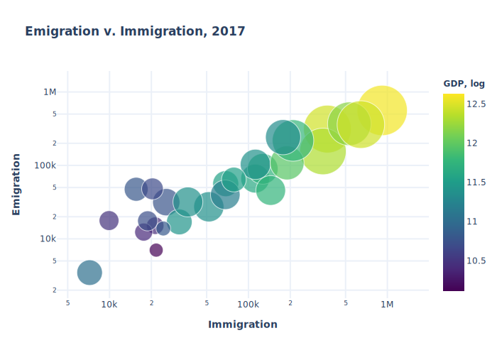

# Блокнот исследования

---

## Содержание
- [Экономическое развитие и миграция](#Анализ-данных-по-экономическому-развитию-и-миграции-в-странах-Евросоюза)
- [Источники](#источники)

## Анализ данных по экономическому развитию и миграции в странах Евросоюза

---
Для начала настраиваем рабочую среду.
Загружаем нужные библиотеки и устанавливаем путь к директории, в которой будем работать:

```py
# Importing libraries
import pandas as pd
import numpy as np
import os
import plotly.graph_objs as go

# Change default directory
os.chdir('C:\\Users\\Nvmind\\github\\thesis-informal-institutions\\Research\\Datasets')

```

Первая база данных (ВВП 1990-2019 гг.) взята с сайта [Worldbank](https://data.worldbank.org/indicator/NY.GDP.MKTP.KD?end=2018&start=2000).

Загружаем изначальный массив во вспомогательную таблицу.

```py
# Auxillary dataframe
aux_df5 = pd.read_csv('gdp_constant_prices.csv')

# Check headers
aux_colnames5 = aux_df5.columns

```

Приведем данные в удобный для дальнейшего использования формат:
```py
gdp = aux_df5[0:28][['Country Name',
                     '2017 [YR2017]']]
# Sort data
gdp = gdp.sort_values(by=['Country Name']).reset_index(drop=True)

```
Вторая база данных (Население стран) взята также с сайта взята с сайта [Worldbank](https://data.worldbank.org/indicator/SP.POP.TOTL).

Проделываем с ней аналогичные операции:
```py
# Import dataframe (population)
aux_df2 = pd.read_csv('population_90to19.csv')

# Check headers
aux_colnames2 = aux_df2.columns

# Clear & Sort
pops = aux_df2[0:28][['Country Name',
                      '2017 [YR2017]']]

pops = pops.sort_values(by=['Country Name']).reset_index(drop=True)

```

Теперь займемся данными по иммиграции и эмиграции в странах Евросоюза. Оба массива с данными взяты с сайта [Eurostat](https://ec.europa.eu/eurostat/data/database). Операции по импорту и обработке данных аналогичны тем, что применялись до этого. Различие состоит лишь в том, что необходимо заменить коды стран на их названия с целью дальнейшего объединения с другими датафреймами.

Для удобства замены создаем вспомогательный словарь ccodes_dict
```py
# Создаем словарь для кодов стран
ccodes = ['AT', 'BE', 'BG', 'CY', 'CZ', 'DE', 'DK', 'EE', 'EL', 'ES', 'FI', 'FR',
          'HR', 'HU', 'IE',  'IT', 'LT', 'LV', 'MT', 'NL', 'PL', 'PT', 'RO', 'SE',
          'SL', 'SK', 'UK', 'LU']

ccodes_dict = {'AT': 'Austria', 'BE': 'Belgium', 'BG': 'Bulgaria', 'CY': 'Cyprus',
               'CZ': 'Czech Republic', 'DE': 'Germany', 'DK': 'Denmark',  'EE': 'Estonia',
               'EL': 'Greece',  'ES': 'Spain',   'FI': 'Finland',  'FR': 'France',
               'HR': 'Croatia', 'HU': 'Hungary', 'IE': 'Ireland',  'IT': 'Italy',
               'LT': 'Lithuania', 'LV': 'Latvia', 'MT': 'Malta', 'NL': 'Netherlands',
               'PL': 'Poland', 'PT': 'Portugal', 'RO': 'Romania', 'SE': 'Sweden',
               'SI': 'Slovenia', 'SK': 'Slovak Republic', 'UK': 'United Kingdom', 'LU': 'Luxembourg'}

```

Как всегда:
```py
# Import dataset (emigration)
aux_df3 = pd.read_csv('tps00177.csv')

# Check headers
aux_colnames3 = aux_df3.columns
print(aux_colnames3)

# Clear & Sort
emigration_total = aux_df3[['geo', '2017']]

emigration_total['geo'] = emigration_total['geo'].map(ccodes_dict)

emigration_total = emigration_total.sort_values('geo').reset_index(drop=True)

print(emigration_total)

# Import dataset (immigration)
aux_df4 = pd.read_csv('tps00176.csv')

# Check Headers
aux_colnames4 = aux_df4.columns
print(aux_colnames4)

# Clear & Sort
immigration_total = aux_df4[['geo', '2017']]

immigration_total['geo'] = immigration_total['geo'].map(ccodes_dict)

immigration_total = immigration_total.sort_values('geo').reset_index(drop=True)

print(immigration_total)

```

Пришло время все консолидировать, создав единую таблицу:
```py
# Consolidate
eu_consolidate = {'Country': pops['Country Name'],
                  'GDP': gdp['2017 [YR2017]'],
                  'Population': pops['2017 [YR2017]'],
                  'Immigration': immigration_total['2017'],
                  'Emigration': emigration_total['2017']}
eu_df = pd.DataFrame(eu_consolidate)
eu_df.to_csv('eu_consolide_ei.csv')
print(eu_df)

```

Наконец-то можно визуализировать все это дело:
```py
# Биг плоу
hover_text = []
bubble_size = []

for index, row in eu_df.iterrows():
    hover_text.append(('Country: {country}<br>' +
                       'Population: {popul}<br>' +
                       'GDP: {gdp}<br>' +
                       'Immigration: {immi}<br>' +
                       'Emigration: {emi}').format(country=row['Country'],
                                                   popul=row['Population'],
                                                   gdp=row['GDP'],
                                                   immi=row['Immigration'],
                                                   emi=row['Emigration']))
    bubble_size.append(np.sqrt(row['Population']))

eu_scatter = go.Figure(data=[go.Scatter(
    x=eu_df['Immigration'],
    y=eu_df['Emigration'],
    text=hover_text,
    mode='markers',
    marker=dict(
        color=np.log10(eu_df['GDP']),
        colorscale='Viridis',
        colorbar=dict(title='<b>GDP, log</b>'),
        cmin=np.log10(12949237121.738998),
        cmax=np.log10(4278004030164.74),
        size=bubble_size,
        sizemin=4,
        sizemode='area',
        sizeref=4.*max(bubble_size)/(100**2),
        line_width=1,
        showscale=True
    )
)])

eu_scatter.update_layout(
    title='<b>Emigration v. Immigration, 2017</b>',
    xaxis=dict(
        title='<b>Immigration</b>',
        gridcolor='#EBF0F8',
        type='log',
        gridwidth=2,
    ),
    yaxis=dict(
        title='<b>Emigration</b>',
        gridcolor='#EBF0F8',
        type='log',
        gridwidth=2,
    ),
    paper_bgcolor='rgb(255, 255, 255)',
    plot_bgcolor='rgb(255, 255, 255)',
)

os.path.relpath(
    'C:\\Users\\Nvmind\\github\\thesis-informal-institutions\\Research\\Graphics', start=None)
eu_scatter.show()
eu_scatter.write_image('..\\Graphics\\ImmiEmi.svg')

```
Интерактивный график на сайте:

[Immigration vs Emigration](https://plot.ly/~Neqqi/1/)

Статичный график:



### Источники:
1. [Eurostat](https://ec.europa.eu/eurostat/data/database)
2. [Datahub](https://datahub.io/)
3. [Worldbank](https://data.worldbank.org/)
